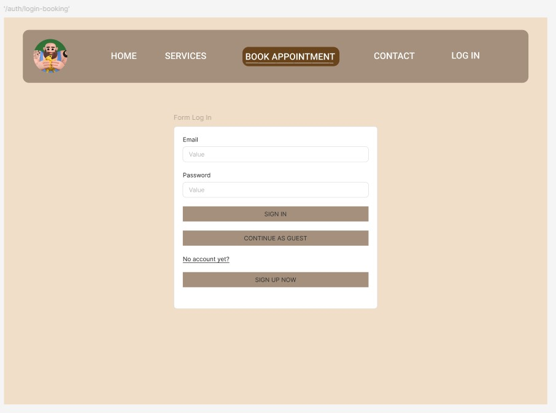

# GA Project 4- barber booking system
Problem statement: Going to the barber in your neighborhood is very tricky, as usually there are no online appointments that can be made.
You can only walk to your local barber and check for availability on the spot, or call them to make a booking.
Chances are, you have encountered situations where you made an appointment and once you reach the shop, you realised that the barber is cutting someone's hair, and you have to wait at the shop.

Solution: this app helps local small barber to manage their appointments, and includes features like membership system to encourage customer loyalty

## Key features
- Login function implemented with JWT ( admin and member login)
- Conditionally rendered Navigation bar depending on whether Admin or Member logs in
- Automated Email confirmation service upon booking / confirmation of appointment
- Full responsive on web / mobile browsers
- Carousel to see user reviews

## Tech stack
#### Frontend: 
- VueJS
- TailwindCSS 
- TailwindCSS animated
- Vue Toastifications
- Vue3 Carousel

#### Backend
- Mongoose
- MongoDB 
- ExpressJS
- NodeJS

#### Development and Version Control
- Vite
- Git

#### Others
- EmailJS
- JWT
- Figma

## Development Process
As i wanted to enhance my own learning, i decided to use 2 new frontend tools to try out on my own. I chose 2 popular tools with strong support, VueJS and TailwindCSS. I had to spend a few days going through youtube tutorials for VueJS [link](https://www.youtube.com/watch?v=VeNfHj6MhgA&t=191s) to get familiarized with the syntax. Next, i had to think about the different pages and functions of the app. The app itself was quite simple, as it only had a few pages for users to navigate and not much information to show. The most challenging part of this project was the booking form, where i allowed users to choose different services with different durations, and the time slot they choose is updated in realtime to show all possible timeslots with no conflicts or double bookings. Another key point is that i begin this process with a mobile first development approach as i wanted this app to be responsive across all devices. 

## Reflection
This capstone project provided me with many learning opportunities. I picked up VueJS and TailwindCSS, which are very popular in the industry now, and also strengthen my knowledge in backend development, especially with authentication and authorization. I also ran into a major problem during the end of the project, where i was trying to integrate a map feature into my app and it caused a huge crash. I had to spend a few days to debug it and costed me a lot of time. Through this, i learnt how to effectively debug my code when a major issue occurs. I initially wanted to use a new language as well, Python, for the backend to connect to MongoDB but after consideration and consulting with the instructor, we concluded that it is better to not be too ambitious and pick up too many new technologies at the same time. 

## Wireframing

## Stretch Goals
- Add membership rewards to customers who hit certain milestones
- Add more services and different durations to the shop
- Implementing a cloud service (AWS?) to allow users to upload images for the reviews
- Propose the idea to the actual shopowner and allow them to use the app for business